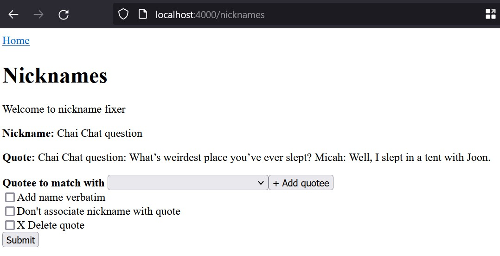
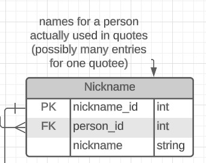
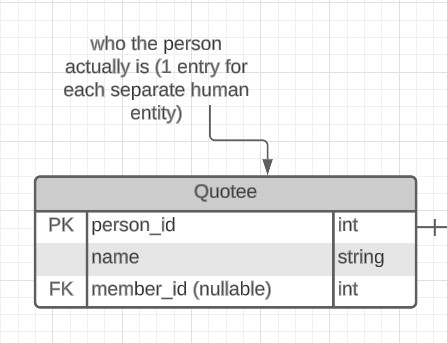

# Quote Board Database - Setup & Admin

Consists of two sections: asstd. setup scripts & info, and an app that runs admin stuff (updating from GroupMe).

Currently only has setup scripts & stuff.

## TODO

- [ ] Recreate code for getting members
  - [ ] Make it able to be optionally used?
- [ ] Make the API stuff
- [ ] Make other admin tools? Like for checking on new quotes that have been added

## File structure

Put raw data in a `data/` subfolder (obviously not included in repo for privacy reasons). This assumes the structure of a GroupMe data export. The only files you really need are `message.json` (contains all messages) and `member.json` (contains all members currently in group at time of export)

## Preparing data for entry into DB

If you need to create initial members or update members, run `node getMembersFromJson.js` to make a CSV for data import. (Currently wants source file to be named `conversation_new.json`, easy to change.)

Run `node index.js` once the members are in the database. (This may require there being nicknames in the database, it may not. There should at least be the table for nickames in the database.) This will create CSVs in the `data/` subdirectory, which can then be used to insert data into the database. It may also create some little text files, used for the classic "lined-up lists" method.

If you want to test the database connection, run `node dbTest.js`. Can't promise what's in there at any given time, useful for testing queries & stuff.

After giving nicknames a `person_id` but not necessarily having directly connected them to quotes, try running `nicknamesToQuotes.js` to fill up the `Quote_Quotee` table. This may take a bit to run. It may take less time to run with `console.log` statements taken out. It'll probably run into a bunch of errors with duplicate insertions, but that's fine, it's just finding entries that are already there. Don't worry about it.

For fixing nicknames (either the first time or as a general maintenance thing), run the admin app (`node app.js`, or `nodemon app.js` if you're making changes to source code and want it to reload), go to the fix nicknames page, and fill out the form as appropriate. (After hitting add quotee and adding a name, it will be at the bottom of the list. You can type to search the dropdown as well.)

## Database Setup Notes

Some manual work may need to be done to re-add members who have since left/been removed from the group. Just find a message where they are and plug in the info manually, or add them to the members JSON if you feel so inclined.

## Environment Variables

Needed environment variables are:

`DB_HOST`

`DB_USER`

`DB_DATABASE`

`DB_PWD`

## Database Structure Documentation

(also show parts from the actual DB? show the setup?)

### Member

This table contains accounts & information associated with accounts that are members of the GroupMe group.

**`member_id: `** Primary key for member, unique ID number provided by GroupMe.

**`groupme_name: `** Name associated with member's GroupMe account.

**`display_name: `** Display name for this member for this group.

**`avatar_image: `** A link to the GroupMe-hosted image that is this user's current avatar image.

**`name: `** Additional field. This is used for general referring to the person or substitutions (e.g., []'s mom). Can be set to default to `groupme_name`, but currently is mostly manually set.

### Quote

This table holds the actual quotes.

**`quote_id: `** Primary key, unique identifier of each quote message. Provided by GroupMe (so long).

**`member_id: `** Id of the member who sent the quote message, foreign key connecting to **Member** table.

**`member_name: `** Display name of member at time of quote; for display purposes.

**`quote_text: `** The full raw text of the quote.

**`time: `** Timestamp of when the quote message was sent.

### Like

This table records which group members liked which quotes, which is just an association of a member with a quote.

**`quote_id: `** Pulled from **Quotes**.

**`member_id: `** Pulled from **Members**.

NOTE: is it possible from API to get when things are liked? Add an optional time to that?

### Nickname

This table stores all the different names and forms of referring to a person used in quotes.

**`nickname_id: `** Auto-generated id

**`person_id: `** Optional field, usually manually filled in by an admin, that connects to one individual person in the `Quotee` table.

**`nickname: `** The actual nickname being stored.

### Quotee

This table stores information about each individual different person who has been quoted.

NOTE: currently a lot of manual setup is kind of required for this oops

**`person_id: `**: Autogenerated id

**`name: `** Name used to refer to quotee/person

**`member_id: `** Foreign key of what this person's member id is, if they are a member of the group (makes it possible to connect both how many times someone quoted and how many times they were quoted)
