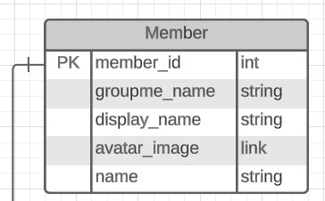
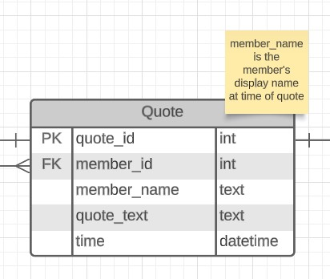
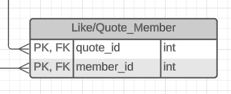

# Quote Board Database - Setup & Admin

Consists of two sections: asstd. setup scripts & info, and an app that runs admin stuff (updating from GroupMe).

Currently only has setup scripts & stuff.

## TODO

- [ ] Recreate code for getting members
  - [ ] Make it able to be optionally used?

## File structure

Put raw data in a `data/` subfolder (obviously not included in repo for privacy reasons). This assumes the structure of a GroupMe data export. The only files you really need are `message.json` (contains all messages) and `member.json` (contains all members currently in group at time of export)

## Preparing data for entry into DB

Run `node index.js`. This will create CSVs in the `data/` subdirectory, which can then be used to insert data into the database. It may also create some little text files, used for the classic "lined-up lists" method.

## Database Setup Notes

Some manual work may need to be done to re-add members who have since left/been removed from the group. Just find a message where they are and plug in the info manually, or add them to the members JSON if you feel so inclined. (This is needed for Katrina at least.)

## Environment Variables

Needed environment variables are:

`DB_HOST`

`DB_USER`

`DB_DATABASE`

`DB_PWD`

## Database Structure Documentation

(also show parts from the actual DB? show the setup?)

### Member

This table contains accounts & information associated with accounts that are members of the GroupMe group.

**`member_id: `** Primary key for member, unique ID number provided by GroupMe.

**`groupme_name: `** Name associated with member's GroupMe account.

**`display_name: `** Display name for this member for this group.

**`avatar_image: `** A link to the GroupMe-hosted image that is this user's current avatar image.

**`name: `** Additional field. This is used for general referring to the person or substitutions (e.g., []'s mom). Can be set to default to `groupme_name`, but currently is mostly manually set.

### Quote

This table holds the actual quotes.

**`quote_id: `** Primary key, unique identifier of each quote message. Provided by GroupMe (so long).

**`member_id: `** Id of the member who sent the quote message, foreign key connecting to **Member** table.

**`quote_text: `** The full raw text of the quote.

**`time: `** Timestamp of when the quote message was sent.

### Like

This table records which group members liked which quotes, which is just an association of a member with a quote.

**`quote_id: `** Pulled from **Quotes**.

**`member_id: `** Pulled from **Members**.

NOTE: is it possible from API to get when things are liked? Add an optional time to that?
